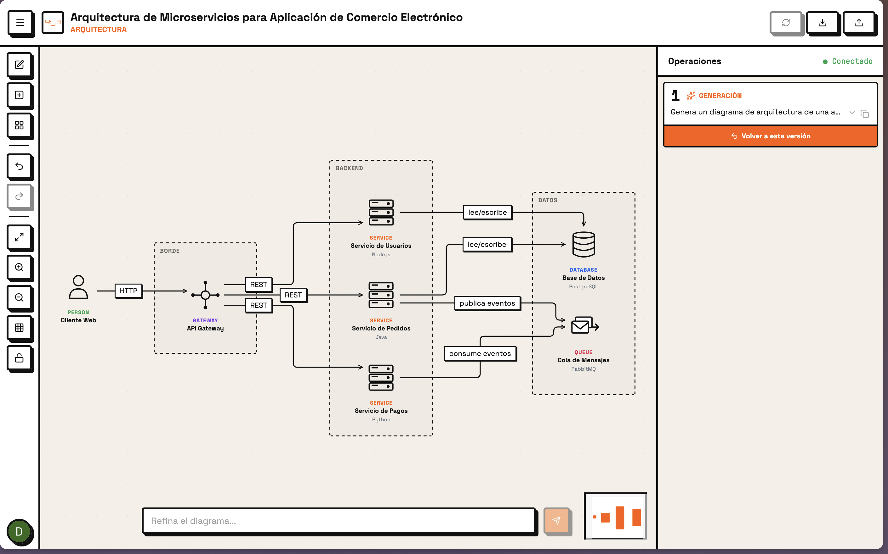
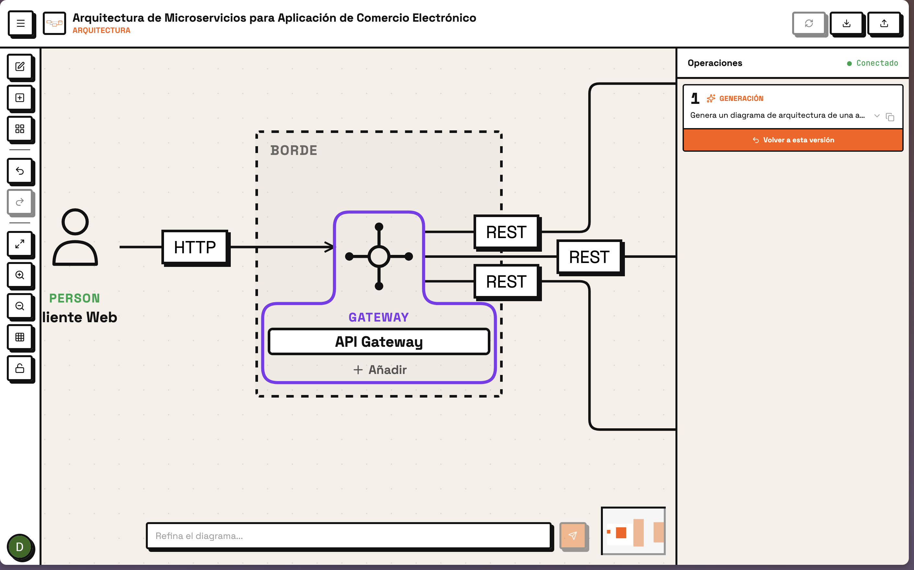
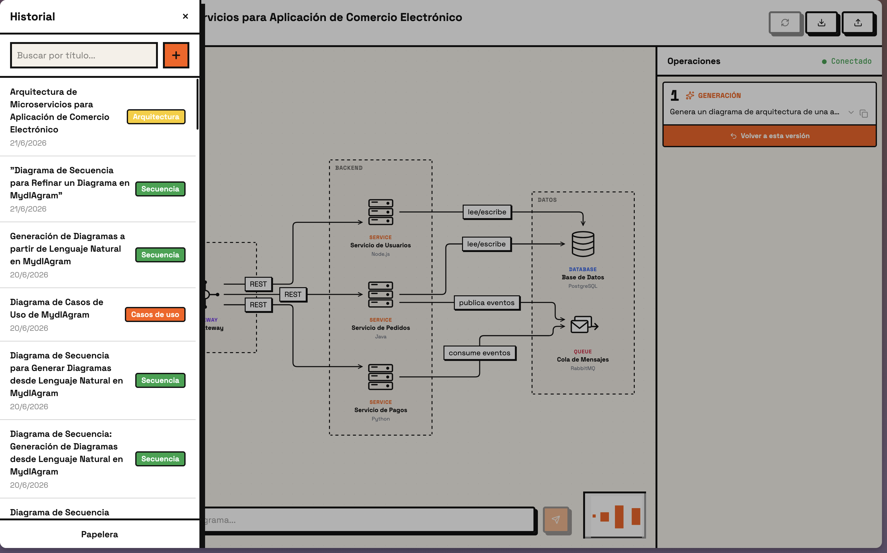
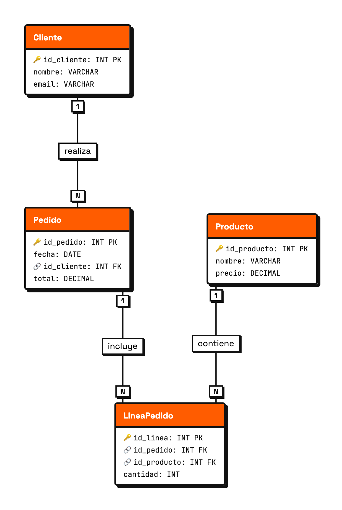
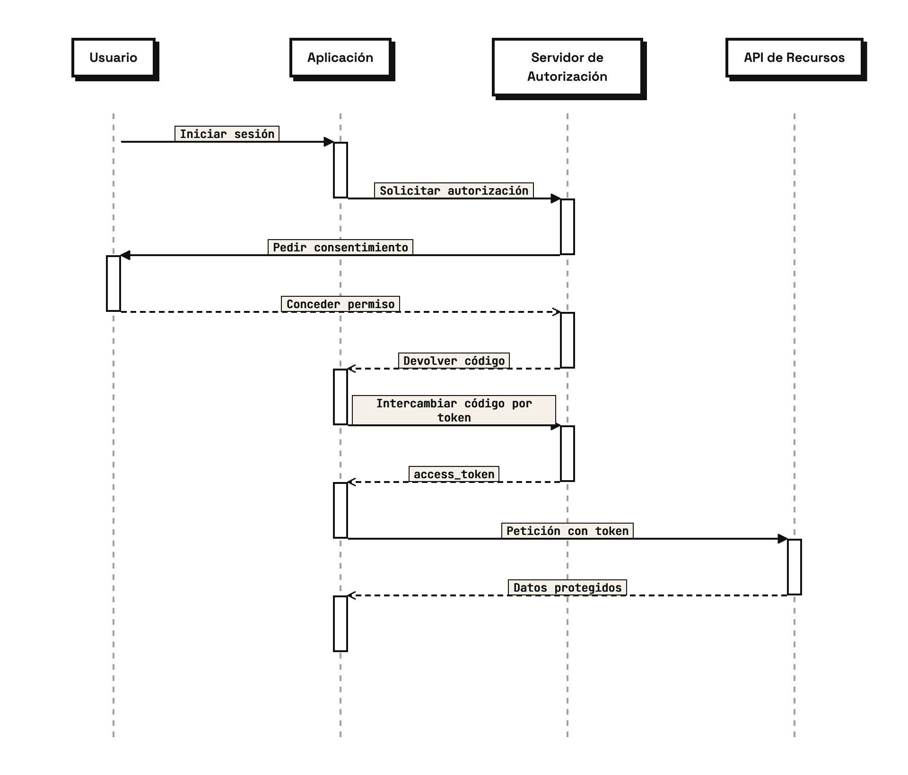
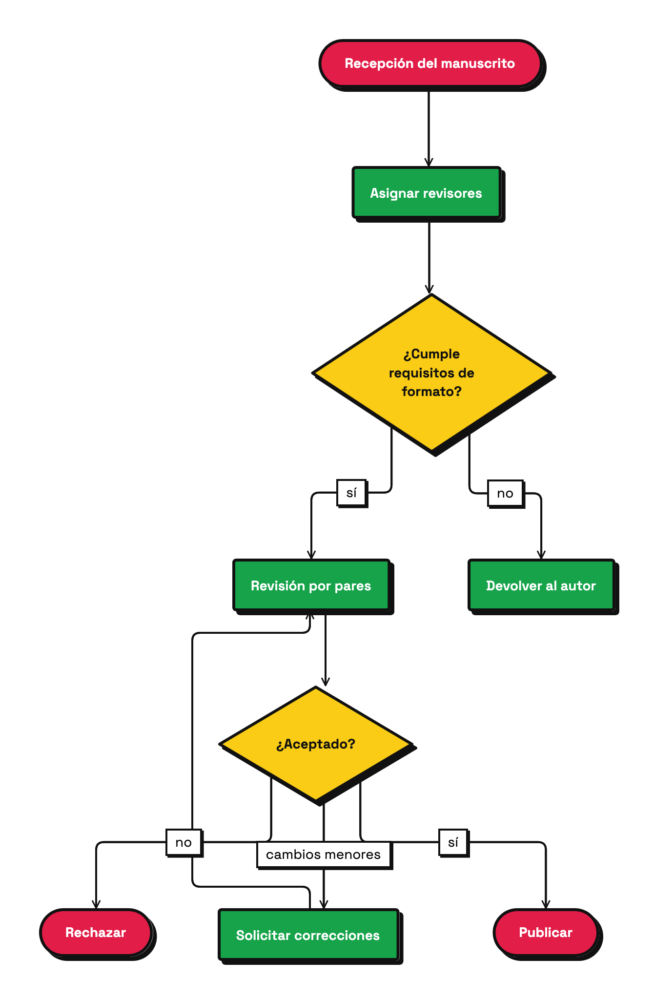
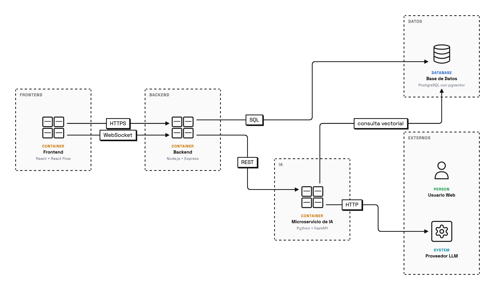
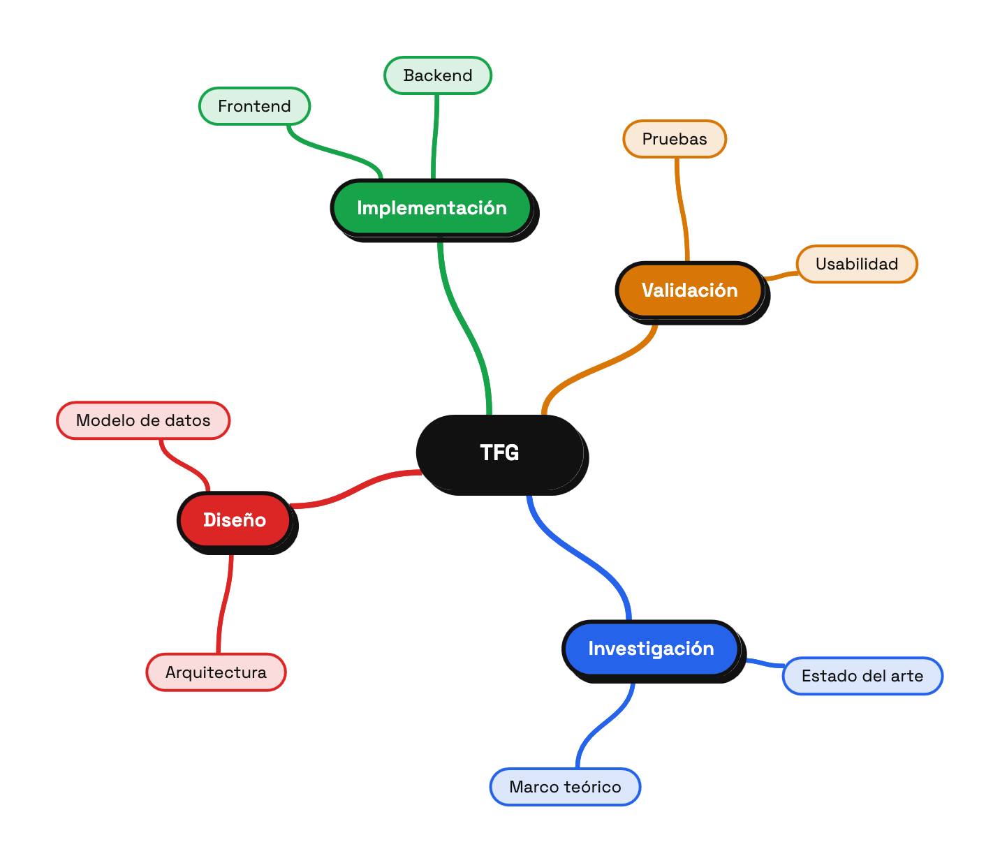
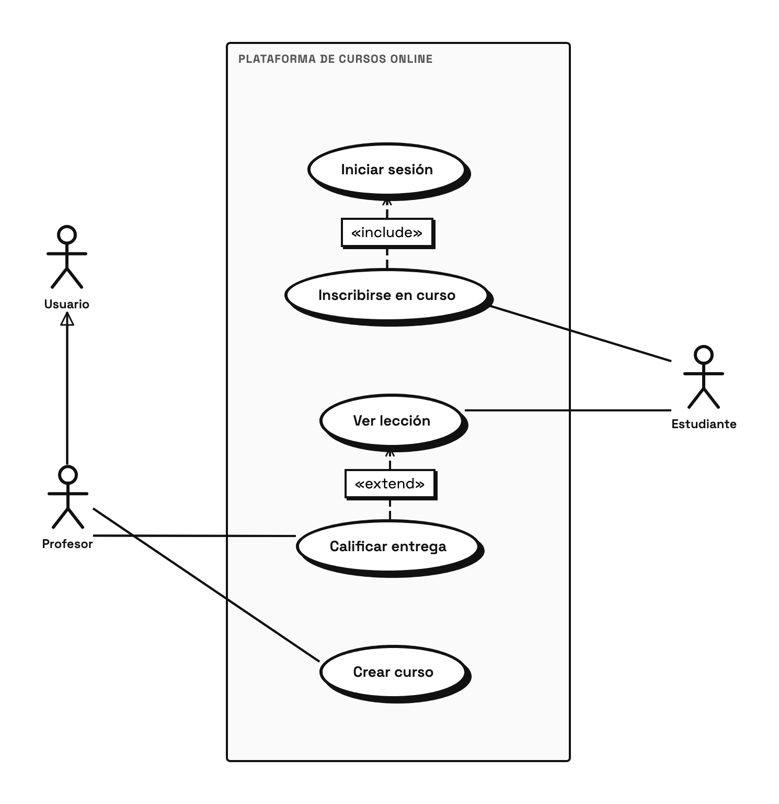

# MydIAgram

**Conversational AI agent that generates editable software diagrams from natural language — with Miro-style direct manipulation.**

[](LICENSE)
[](https://nodejs.org/)
[](https://python.org/)
[](https://react.dev/)
[](https://typescriptlang.org/)
[](https://fastapi.tiangolo.com/)

MydIAgram turns plain-text descriptions into interactive, editable diagrams — ERD, UML class, sequence, flowchart, architecture (C4), state machine, and mindmap — rendered on a drag-and-drop canvas. An AI agent powered by LangGraph classifies the diagram type, extracts nodes and edges via structured LLM tool calls, validates the output against strict schemas, and streams every step to the UI in real time. Users can refine diagrams conversationally, and the agent can ask clarifying questions when the input is ambiguous.

The canvas provides Miro-style direct manipulation: double-click to edit text inline, drag connection handles from node borders with snap feedback, add edge labels and slide them along the path, and bend edges by dragging waypoints — all without side panels or modal forms.



## Features

### AI-powered diagram generation
- **Natural language to diagram** — describe what you need; the agent classifies the type, extracts structure, and renders it instantly
- **7 diagram types** — Entity-Relationship, UML Class, Sequence, Flowchart, Architecture (C4), State Machine, Mindmap — each with dedicated node shapes and layout logic
- **Conversational refinement** — after generating a diagram, send follow-up prompts to modify it; the agent can ask clarification questions mid-generation
- **Real-time streaming** — every agent tool call (classify, extract, validate) streams to the frontend via WebSocket, with a collapsible tool tray showing live progress
- **Multi-LLM support** — switch between local inference (Ollama / Qwen3), OpenAI (GPT-4o), or Anthropic via a single `LLM_PROFILE` env var
- **Generation cache** — identical prompts return cached results, reducing LLM calls and latency

### Miro-style direct manipulation
- **Inline node editing** — double-click any node to edit its text in place; `Esc`/`Enter`/click outside to confirm. Select a node and start typing to replace its label. No side panel required
- **Connection handles on hover** — 4 handles appear at each node border on hover; drag from one to another to create an edge with floating anchor (nearest border intersection)
- **Snap-to-target feedback** — the destination node glows blue when the cursor enters its area during a connection drag
- **Inline edge labels** — double-click any edge to add/edit a text label; drag the label along the path (position stored as a `0–1` ratio)
- **Waypoint manipulation** — drag an edge segment to create a bend point; double-click a waypoint to delete it. Edges support `straight`, `elbow`, and `curved` shapes
- **Endpoint re-anchoring** — drag an edge's source or target endpoint to reconnect it to a different node, with a dashed preview path during the drag
- **Edge context menu** — right-click an edge to change its shape, stroke style (`normal`/`dashed`/`dotted`), and toggle source/target arrowheads



### Canvas & UI
- **Neobrutalist design** — bold borders, hard shadows, Space Grotesk / JetBrains Mono typography, orange accent palette, light/dark theme toggle persisted in localStorage
- **Undo/redo** — 50-snapshot history stack with keyboard shortcuts
- **Auth + persistence** — Google OAuth via Supabase; diagrams saved to PostgreSQL with full history, search, and reload
- **Export** — PNG screenshot or JSON schema export; JSON import for sharing diagrams
- **Rate limiting** — backend throttles requests to prevent abuse



## Example diagrams

Diagrams generated by MydIAgram from natural-language prompts and rendered on the canvas:

<table>
  <tr>
    <td align="center"><br><b>Entity-Relationship</b></td>
    <td align="center"><br><b>Sequence</b></td>
    <td align="center"><br><b>Flowchart</b></td>
  </tr>
  <tr>
    <td align="center"><br><b>Architecture (C4)</b></td>
    <td align="center"><br><b>Mindmap</b></td>
    <td align="center"><br><b>Use cases</b></td>
  </tr>
</table>

## Architecture

```
┌──────────────┐       WebSocket / HTTP        ┌──────────────┐       HTTP / SSE        ┌───────────────────┐
│   Frontend   │  ◄──────────────────────────►  │   Backend    │  ◄──────────────────►   │   Agent (Python)  │
│  React + Vite│       Socket.io + REST         │  Express.js  │     FastAPI streaming   │   LangGraph ReAct │
│  React Flow  │                                │  Socket.io   │                         │   LLM tool calls  │
└──────┬───────┘                                └──────┬───────┘                         └──────────┬────────┘
       │                                               │                                           │
       └───────────────────────┬───────────────────────┘                                           │
                               │                                                                   │
                        ┌──────▼───────┐                                              ┌────────────▼──────┐
                        │   Supabase   │                                              │   LLM Provider    │
                        │  PostgreSQL  │                                              │ Ollama / OpenAI / │
                        │  + Auth      │                                              │ Anthropic         │
                        └──────────────┘                                              └───────────────────┘
```

| Layer | Stack |
|---|---|
| Frontend | React 19 + Vite 8 + React Flow 12 + Zustand 5 + Tailwind CSS 4 + TypeScript 5.9 |
| Backend (API Gateway) | Node.js 22 + Express 5 + Socket.io 4 + TypeScript 6 |
| Agent (AI Microservice) | Python 3.12 + FastAPI 0.135 + LangGraph + Pydantic 2.12 |
| Database & Auth | Supabase (PostgreSQL 16 + Google OAuth) |

## Requirements

| Dependency | Minimum version |
|---|---|
| Node.js | 22.x |
| npm | 10.x |
| Python | 3.12+ |
| pip | 23+ |
| Supabase CLI | latest ([install](https://supabase.com/docs/guides/cli/getting-started)) |
| Ollama (local LLM) | latest ([install](https://ollama.com/)) — only if using `LLM_PROFILE=local` |

## Installation

### 1. Clone the repository

```bash
git clone https://gitlab.com/HP-SCDS/Observatorio/2025-2026/mydiagram/usc-mydiagram.git
cd usc-mydiagram
```

### 2. Set up the database (Supabase)

```bash
supabase start
supabase db reset    # applies all migrations from supabase/migrations/
```

Note the `API URL`, `anon key`, and `service_role key` from the output.

### 3. Configure environment variables

**Backend** — create `backend/.env`:

```env
SUPABASE_URL=http://127.0.0.1:54321
SUPABASE_SERVICE_ROLE_KEY=<service_role key from step 2>
SUPABASE_JWT_SECRET=<jwt secret from supabase start output>
PORT=3001
AGENT_URL=http://localhost:8000
```

**Agent** — copy and edit `agent/.env`:

```bash
cp agent/.env.example agent/.env
```

```env
LLM_PROFILE=local              # or "openai" for production
OLLAMA_URL=http://localhost:11434/api/chat
OLLAMA_MODEL_FAST=qwen3:8b
OLLAMA_MODEL_CAPABLE=qwen3:8b
# For OpenAI: set OPENAI_API_KEY, OPENAI_MODEL_FAST, OPENAI_MODEL_CAPABLE
```

**Frontend** — create `frontend/.env`:

```env
VITE_SUPABASE_URL=http://127.0.0.1:54321
VITE_SUPABASE_ANON_KEY=<anon key from step 2>
VITE_WS_URL=http://localhost:3001
```

### 4. Install dependencies

```bash
# Frontend
cd frontend && npm install && cd ..

# Backend
cd backend && npm install && cd ..

# Agent
cd agent && pip install -r requirements.txt && cd ..
```

### 5. Pull the local LLM model (if using Ollama)

```bash
ollama pull qwen3:8b
```

### 6. Start all three services

Open three terminal windows:

```bash
# Terminal 1 — Agent (Python)
cd agent && uvicorn main:app --host 0.0.0.0 --port 8000 --reload

# Terminal 2 — Backend (Node.js)
cd backend && npm run dev

# Terminal 3 — Frontend (Vite)
cd frontend && npm run dev
```

The app will be available at `http://localhost:5173`.

## Usage

### Generate a diagram from natural language

Type a prompt in the floating input at the bottom of the canvas:

```
Diseña un diagrama entidad-relación para una tienda online con usuarios,
productos, pedidos y reseñas.
```

The agent will:
1. Classify the diagram type (or use your manual selection from the top bar)
2. Extract nodes and edges via LLM tool calls (streamed in the tool tray)
3. Validate the schema
4. Render the diagram on the canvas

### Refine an existing diagram

With a diagram loaded, type a follow-up:

```
Añade una entidad "Categoría" con relación muchos-a-muchos con Producto.
```

### Edit nodes inline

Double-click any node to edit its text directly on the canvas. Press `Esc`, `Enter`, or click outside to confirm. You can also select a node and start typing to replace its label immediately.

### Manipulate edges

| Action | Gesture |
|---|---|
| Create a connection | Hover over a node to reveal handles → drag from any handle to another node |
| Add/edit a label | Double-click the edge path |
| Slide a label | Drag the label text along the edge |
| Bend an edge | Drag a midpoint (white dot) on a selected edge to create a waypoint |
| Remove a waypoint | Double-click the blue control point |
| Change shape/stroke/arrows | Right-click the edge → context menu |
| Re-anchor an endpoint | Drag the blue endpoint circle to a different node |

### Select a diagram type manually

Click one of the type cards in the top bar (ERD, UML Class, Sequence, Flowchart, Architecture, State Machine, Mindmap) before sending your prompt. Select "Auto" to let the agent decide.

### Export and import

Use the export menu (top-right) to:
- **Export PNG** — screenshot of the current canvas
- **Export JSON** — full diagram schema (nodes, edges, types)
- **Import JSON** — load a previously exported diagram

### Run tests

```bash
# Frontend (Vitest — 216+ tests)
cd frontend && npm test

# Backend (Vitest + supertest)
cd backend && npm test

# Agent (pytest)
cd agent && pytest
```

### Production build

```bash
cd frontend && npm run build    # outputs to frontend/dist/
cd backend && npm run build     # compiles to backend/dist/
```

## Project structure

```
usc-mydiagram/
├── frontend/                              # React SPA
│   ├── src/
│   │   ├── components/
│   │   │   ├── DiagramCanvas.tsx           # React Flow canvas — registers all node/edge types
│   │   │   ├── TopBar.tsx                 # Nav bar: type cards, theme toggle, auth
│   │   │   ├── EditToolbar.tsx            # Left toolbar: add node/edge, undo/redo, zoom
│   │   │   ├── FloatingPrompt.tsx         # Chat input overlay (auto-resize, 3 modes)
│   │   │   ├── ChatPanel.tsx              # Message history panel (right column)
│   │   │   ├── ChatMessage.tsx            # Individual message bubble
│   │   │   ├── ToolTray.tsx               # Collapsible agent tool trace viewer
│   │   │   ├── HistoryDrawer.tsx          # Slide-out drawer: diagram history + search
│   │   │   ├── DiagramTypeCards.tsx        # Horizontal type selector cards
│   │   │   ├── ExportMenu.tsx             # Export PNG/JSON, import, save, regenerate
│   │   │   ├── AuthButton.tsx             # Google OAuth login/logout
│   │   │   ├── nodes/                     # Custom React Flow node components
│   │   │   │   ├── TableNode.tsx          # ERD table with PK/FK markers
│   │   │   │   ├── UmlClassNode.tsx       # UML class (attrs/methods sections)
│   │   │   │   ├── C4Node.tsx             # C4 model (person/system/container/component)
│   │   │   │   ├── ArchitectureNode.tsx   # DB/queue/gateway/service shapes
│   │   │   │   ├── FlowNode.tsx           # Flowchart (step/decision/terminator)
│   │   │   │   ├── StateNode.tsx          # State machine states
│   │   │   │   ├── MindmapNode.tsx        # Mindmap topic nodes
│   │   │   │   ├── SequenceActorNode.tsx  # Sequence diagram participants
│   │   │   │   ├── LifelineNode.tsx       # Vertical dashed lifelines
│   │   │   │   └── ActivationNode.tsx     # Activation bars on lifelines
│   │   │   └── edges/                     # Custom React Flow edge components
│   │   │       ├── EditableEdge.tsx       # Full-featured edge: labels, waypoints, re-anchor
│   │   │       ├── EdgeContextMenu.tsx    # Right-click menu: shape, stroke, arrows
│   │   │       └── SequenceMessageEdge.tsx# Horizontal sequence messages
│   │   ├── store/
│   │   │   ├── index.ts                   # Main Zustand store (diagram + generation state)
│   │   │   ├── auth.ts                    # Authentication store (Supabase session)
│   │   │   ├── ui.ts                      # UI-only state (drawer, theme, tool tray)
│   │   │   ├── history.ts                 # Undo/redo stack (50 snapshots, session-scoped)
│   │   │   └── historyManager.ts          # Auto-capture snapshots on diagram changes
│   │   ├── hooks/
│   │   │   ├── useInlineEdit.ts           # Shared hook: dblclick/type-to-edit, Esc/Enter/blur
│   │   │   ├── useWebSocket.ts            # Socket.io connection + stream handling
│   │   │   └── useAuth.ts                 # Supabase auth session hook
│   │   ├── ui/
│   │   │   ├── primitives/                # Neobrutalist design system (8 components)
│   │   │   └── utils/
│   │   │       ├── diagramToFlow.ts       # Agent schema → React Flow nodes/edges + layout
│   │   │       ├── sequenceLayout.ts      # Sequence diagram layout engine
│   │   │       ├── getFloatingAnchor.ts   # Nearest border intersection for edge anchoring
│   │   │       ├── getWaypointPath.ts     # SVG path from waypoints (straight/elbow/curved)
│   │   │       ├── getPathProjection.ts   # Project a point onto an SVG path (label drag)
│   │   │       └── stagingLayout.ts       # Staging area layout utilities
│   │   ├── lib/
│   │   │   └── api.ts                     # Supabase REST client (diagram CRUD)
│   │   ├── types.ts                       # Zod schemas + TypeScript types
│   │   ├── index.css                      # Tailwind v4 + neobrutalist design tokens
│   │   └── main.tsx                       # Entry point
│   ├── package.json
│   ├── vite.config.ts
│   └── tsconfig.json
├── backend/                               # API Gateway
│   └── src/
│       ├── index.ts                       # Express + Socket.io server (port 3001)
│       ├── diagrams.ts                    # Diagram CRUD endpoints
│       ├── socketHandlers.ts              # WebSocket handlers — relay agent streams
│       ├── agentStream.ts                 # HTTP/SSE client for agent microservice
│       ├── auth.ts                        # JWT verification middleware
│       ├── socketAuth.ts                  # WebSocket authentication
│       ├── cache.ts                       # Generation cache (DB-backed)
│       ├── rateLimit.ts                   # Request rate limiter
│       └── supabase.ts                    # Supabase client singleton
├── agent/                                 # AI Microservice
│   ├── main.py                            # FastAPI app (/generate/stream, /refine/stream)
│   ├── graph.py                           # LangGraph graph definition
│   ├── agent_graph.py                     # ReAct agent workflow
│   ├── llm.py                             # LLM provider abstraction (Ollama/OpenAI/Anthropic)
│   ├── prompts.py                         # Structured system + tool prompts
│   ├── schemas.py                         # Pydantic models for diagram validation
│   ├── nodes/                             # LangGraph workflow nodes
│   │   ├── classify.py                    # Diagram type classification
│   │   ├── extract_nodes.py               # Node extraction via LLM tool calls
│   │   ├── extract_edges.py               # Edge extraction via LLM tool calls
│   │   ├── validate_nodes.py              # Node schema validation
│   │   ├── validate_edges.py              # Edge schema validation
│   │   ├── validate_schema.py             # Full diagram schema validation
│   │   ├── synthesize.py                  # Final diagram assembly
│   │   └── guard.py                       # Safety guardrails
│   ├── tests/                             # pytest test suite
│   └── requirements.txt
├── supabase/
│   ├── config.toml                        # Local Supabase configuration
│   └── migrations/                        # SQL migrations (diagrams, cache, auth)
├── scripts/
│   └── test_tools_e2e.sh                  # End-to-end integration test script
├── docs/                                  # Technical documentation
└── LICENSE                                # MIT
```

## Contributing

1. Fork the repository on GitLab
2. Create a feature branch from `main`:
   ```bash
   git checkout -b feature/your-feature
   ```
3. Make your changes, ensuring:
   - `npm test` passes in both `frontend/` and `backend/`
   - `pytest` passes in `agent/`
   - `cd frontend && npm run build` compiles without errors
   - `cd frontend && npm run lint` reports no errors
4. Commit with a [Conventional Commits](https://www.conventionalcommits.org/) message:
   ```bash
   git commit -m "feat(frontend): add node grouping support"
   ```
5. Push and open a Merge Request against `main`

### Hard constraints (do not break)

- Do not rename or remove fields/actions in `store/index.ts` or `store/auth.ts`
- Do not change socket event names or payloads in `hooks/useWebSocket.ts`
- Do not modify enum values in `DiagramType`, `NodeType`, `EdgeType`, or Zod schemas in `types.ts`
- Do not change REST endpoint signatures in `lib/api.ts`

## Academic context

MydIAgram is the Final Degree Project (*Trabajo de Fin de Grao*, TFG) for the *Grao en Enxeñaría Informática* at the Escola Técnica Superior de Enxeñaría, Universidade de Santiago de Compostela (USC), developed within the HP-SCDS Observatorio (2025–2026).

- **Author** — Diego Cristóbal Andaluz
- **Tutor** — Juan Carlos Vidal Aguiar (Departamento de Electrónica e Computación, Universidade de Santiago de Compostela)
- **Co-tutor** — Rubén López Fernández (HP)

## License

[MIT](LICENSE) &copy; 2025 Observatorio HP SCDS
